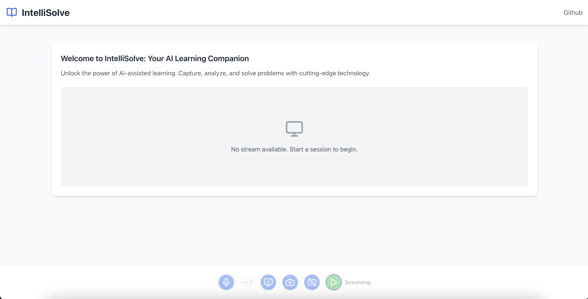
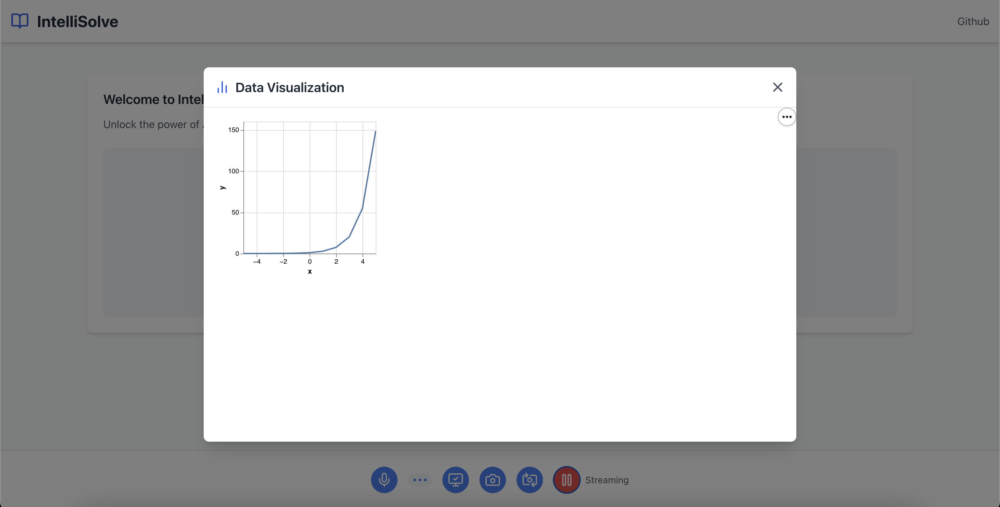

# IntelliSolve: AI-Powered Educational Assistant

## Overview

IntelliSolve is an advanced AI-powered educational platform designed to provide interactive learning experiences through real-time video, screen capture, and AI-generated visualizations.





## Features

### 🤖 AI-Powered Assistance
- Real-time interaction with Google's Generative AI
- Contextual problem-solving capabilities
- Multimodal input support (video, audio, screen capture)

### 📊 Dynamic Visualization
- Altair-powered graph generation
- Instant data visualization
- Interactive modal-based graph viewing

### 🎥 Media Capture
- Webcam streaming
- Screen capture functionality
- Flexible camera switching

## Prerequisites

- Node.js (v16.0.0 or later)
- npm (v8.0.0 or later)
- Google AI API Key

## Installation

1. Clone the repository:
```bash
git clone https://github.com/munsuyog/intellisolve.git
cd intellisolve
```

2. Install dependencies:
```bash
npm install
```

3. Create a `.env` file in the project root:
```
REACT_APP_GEMINI_API_KEY=your_google_ai_api_key_here
```

## Configuration

### API Key Setup
1. Visit [Google AI Studio](https://makersuite.google.com/app/apikey)
2. Create a new API key
3. Copy the key to your `.env` file

### Available Scripts
- `npm start`: Run the development server
- `npm run build`: Create production build
- `npm test`: Run test suite

## Technologies

- React
- TypeScript
- Tailwind CSS
- Google Generative AI
- Vega Embed
- Lucide React Icons


Project Link: [https://github.com/munsuyog/intellisolve](https://github.com/your-username/intellisolve)

## Acknowledgements

- [Google AI](https://ai.google)
- [React](https://reactjs.org)
- [Tailwind CSS](https://tailwindcss.com)